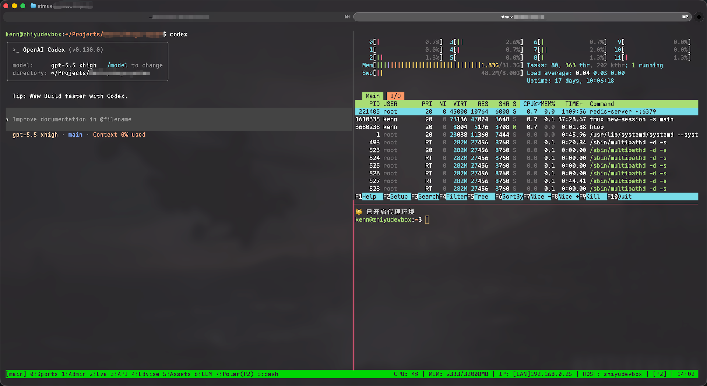

# stmux

[English] | [中文版](README_CN.md)

`stmux` is a small local launcher for people who manage long-lived work on remote servers through `tmux`.
It wraps `ssh` + `tmux attach/new-session`, optionally syncs your local tmux config to the server, and keeps the remote status bar useful with CPU, memory, and IP information.

This README reflects the current implementation in this repository, including the `status.sh` monitoring script and the current `sync` behavior.



## What It Includes

- `stmux`: local entry command that connects to a remote SSH host and attaches to a tmux session, or creates it if missing.
- `.tmux.conf`: shared tmux configuration with dual prefix support, mouse support, OSC 52 clipboard integration, and simplified split shortcuts.
- `.tmux/status.sh`: status bar helper that prints CPU, memory, and rotating IPv4 information for the remote server.
- `install.sh`: base installer for `stmux` and `~/.tmux.conf`.

## Current Workflow

`stmux` does two things:

1. Optionally syncs your local `~/.tmux/` directory and `~/.tmux.conf` to the remote server.
2. Opens an interactive SSH session, then runs:
   - `tmux attach -t <session>`
   - or `tmux new-session -s <session>` if that session does not exist.

After you detach from tmux, the script asks whether you want to stay in the remote shell instead of disconnecting immediately.

## Installation

### 1. Base Installation

```bash
chmod +x install.sh
./install.sh
```

This installs:

- `~/.tmux.conf`
- `~/.tmux/status.sh`
- `/usr/local/bin/stmux`

After installation, your local `~/.tmux/status.sh` is already in place, so `stmux <host> <session> sync` can push it to remote servers immediately.

### 2. Optional: Manual Installation

If you do not want to use `install.sh`, install everything explicitly:

```bash
cp .tmux.conf ~/.tmux.conf
mkdir -p ~/.tmux
cp .tmux/status.sh ~/.tmux/status.sh
chmod +x ~/.tmux/status.sh
sudo cp stmux /usr/local/bin/stmux
sudo chmod +x /usr/local/bin/stmux
```

## Command Syntax

```bash
stmux <ssh-alias> [session_name] [sync]
```

- `ssh-alias`: host alias defined in your local `~/.ssh/config`
- `session_name`: optional tmux session name, defaults to `main`
- `sync`: optional literal flag; when present in the third position, `stmux` syncs local tmux files before connecting

Important:

- `sync` is positional, not a generic flag parser.
- If you want to sync and still use the default session, use `main` explicitly:

```bash
stmux my-server main sync
```

If you run `stmux my-server sync`, the script will treat `sync` as the session name.

## Common Usage

### First-time recommended flow

```bash
stmux my-server main sync
```

Run this first on a new machine or before the first connection to a given server.
That ensures the remote server receives your current `~/.tmux.conf` and `~/.tmux/status.sh` before tmux starts.

### Connect to the default session

```bash
stmux my-server
```

This connects to host `my-server` and attaches to session `main`, or creates it if needed.

### Connect to a named session

```bash
stmux my-server logs
```

### Sync first, then connect

```bash
stmux my-server dev sync
```

## What `sync` Actually Does

When the third argument is `sync`, `stmux` currently:

- creates remote `~/.tmux/` if it does not exist
- tries `rsync -avz ~/.tmux/ <host>:~/.tmux/`
- falls back to `scp -r ~/.tmux/* <host>:~/.tmux/` if `rsync` fails or is unavailable
- copies local `~/.tmux.conf` to remote `~/.tmux.conf`
- runs `chmod +x ~/.tmux/status.sh` on the remote host

Notes:

- `rsync` excludes files matching `*_index_*`
- the source of truth for `sync` is your local home directory, not this repo directory
- if your local `~/.tmux/status.sh` is missing, `sync` cannot magically create it on the remote host

## Tmux Behavior Provided by `.tmux.conf`

The current config enables:

- dual prefix support: default `Ctrl+b` still works, and `Ctrl+a` is added as `prefix2`
- mouse support
- tmux clipboard integration through OSC 52
- copy selection without clearing the visual selection immediately
- split shortcuts:
  - `Prefix + \` for horizontal layout split (`split-window -h`)
  - `Prefix + -` for vertical stack split (`split-window -v`)
- traditional tmux split shortcuts `Prefix + %` and `Prefix + "` are intentionally unbound in this config
- split panes start in the current pane's working directory
- `Prefix + r` reloads `~/.tmux.conf`
- red active pane border
- green status bar with host, pane index, time, and status script output

## Common Tmux Shortcuts

In this repo, `Prefix` means either `Ctrl+b` or `Ctrl+a`.

- `Prefix + c`: create a new window
- `Prefix + ,`: rename the current window
- `Prefix + w`: list windows and switch interactively
- `Prefix + d`: detach from the current tmux session
- `Prefix + \`: split left/right
- `Prefix + -`: split up/down
- `Prefix + r`: reload `~/.tmux.conf`

If you are used to stock tmux defaults, note again that this config does not use `%` and `"` for splitting.

## Status Bar Monitoring Script

`~/.tmux/status.sh` is used by `.tmux.conf` in the right side of the tmux status bar.
It currently prints:

- CPU usage
- memory usage
- one IPv4 address at a time, rotating across detected interfaces

Interface labels currently include:

- `LAN` for `enp*`
- `ETH` for `eth*`
- `ZT` for `zt*`
- `NET` for everything else

If no suitable IPv4 address is found, it prints `No IP`.

## Requirements

### Local machine

- `bash`
- `ssh`
- `scp`
- optionally `rsync` for faster syncs
- a valid SSH alias in `~/.ssh/config`

### Remote server

- `bash`
- `tmux`
- common Linux utilities used by the status script, especially `top`, `free`, `ip`, and `hostname`

The status script contains a macOS branch for compatibility, but the intended target is a Linux remote server.

## Terminal Compatibility Note

Before launching remote tmux, `stmux` sends escape sequences that disable mouse reporting.
This is part of the current workaround for Ghostty-related terminal noise before tmux attaches.

## Troubleshooting

### Status bar is missing CPU, memory, or IP info

Check these first:

- remote `~/.tmux/status.sh` exists
- remote `~/.tmux/status.sh` is executable
- remote server has `free`, `ip`, and `top`
- you have reloaded tmux config with `Prefix + r`, or reconnected with `sync`

### `sync` falls back from `rsync` to `scp`

That is expected if `rsync` is not installed locally or remotely, or if `rsync` fails for another reason.
The script will continue with `scp`.

### `ssh` host cannot be found

Make sure the first argument is an alias defined in your local `~/.ssh/config`.

## Repository Layout

```text
.
├── .tmux.conf
├── .tmux/
│   └── status.sh
├── install.sh
└── stmux
```
